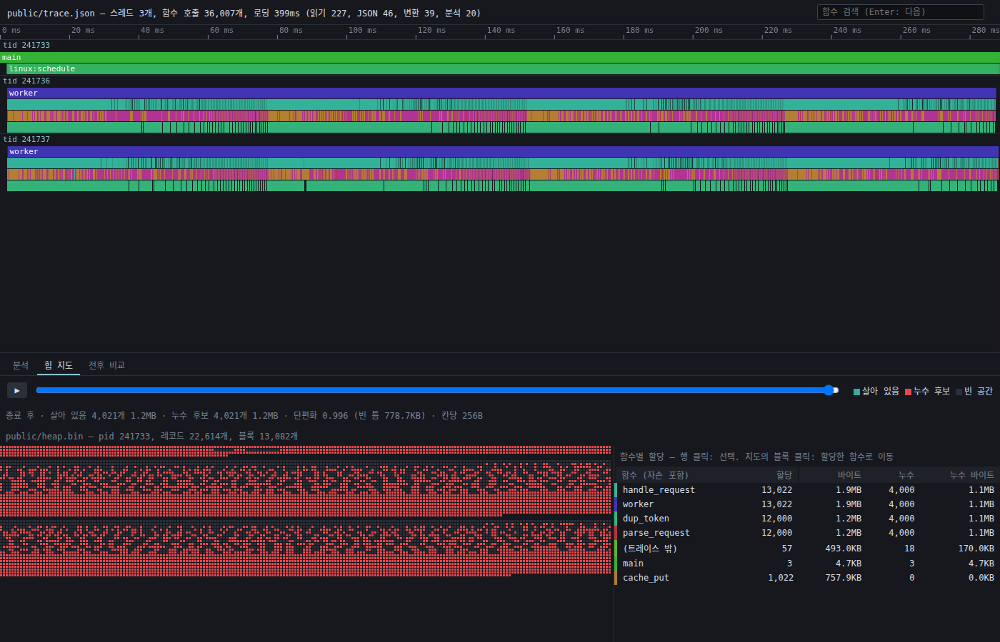

# perf-lens

함수 호출 타임라인(uftrace)과 malloc/free 기록(직접 만든 `libheapmap`)을 **같은 시계로 연결**해서,
"이 함수가 느린 이유"와 "이 함수가 먹은 메모리"를 한 화면에서 본다.

**데모: https://wnsrud2002.github.io/perf-lens/** (샘플 트레이스가 바로 열린다. 서버 없이 브라우저 안에서 모두 처리한다)



## 사용법

```bash
# 1. 대상은 -pg로 빌드한다
gcc -pg -g -O1 -o myprog myprog.c

# 2. 트레이스와 힙 기록을 한 번 실행으로 남긴다 (uftrace 필요: apt install uftrace)
scripts/perf-lens record -o out ./myprog 인자...

# 3. out/trace.json과 out/heap.bin을 뷰어에 함께 드롭한다
```

- **분석** 탭: 타임라인(휠 줌, 드래그 팬, 검색), 플레임 그래프, 느린 함수 Top 10(self / total)
- **힙 지도** 탭: 주소 공간 격자, 시간 슬라이더 재생, 종료까지 살아 있는 블록(누수 후보)은 빨간색, 단편화 지수
- 타임라인에서 함수를 클릭하면 그 함수가 한 할당이 지도에서 강조되고, 블록을 클릭하면 할당한 함수로 이동한다. 함수별 할당 횟수·바이트·누수 표가 나온다
- **전후 비교** 탭: 지금 결과를 기준으로 잡고 고친 버전을 드롭하면 함수별 변화가 나온다

샘플(`samples/leaky_server.c`)에는 느린 함수, 누수, 단편화를 일부러 넣었다. `cd samples && make trace.json`으로 다시 기록한다.

## 구조

```
[Orin Nano : 수집]
  대상 프로그램 (-pg 빌드)
   ├─ uftrace record ──dump --chrome──▶ trace.json
   └─ LD_PRELOAD=libheapmap.so ────────▶ heap.bin (16바이트 레코드, heapmap/FORMAT.md)
                  │  둘 다 CLOCK_MONOTONIC + tid
                  ▼
[브라우저 뷰어 : TypeScript + Canvas 2D, 외부 라이브러리 없음]
   ├─ Web Worker: 파싱, TypedArray 열 구조로 인덱싱
   ├─ 할당 (ts, tid) → 그 순간 실행 중이던 함수 (깊이별 이진 탐색)
   └─ Canvas: 타임라인 / 플레임 그래프 / 힙 지도
```

## 수치

측정 조건과 재현 방법은 [BENCH.md](BENCH.md)에 있다. Jetson Orin Nano, `jetson_clocks` 적용.

**뷰어: jq 트레이스, 함수 호출 72만 건 (104MB JSON)**

| 지표 | 최적화 전 | 최적화 후 |
|---|---|---|
| 로딩 → 첫 화면 | 3,041 ms | 2,063 ms |
| 로딩 중 최장 멈춤 | 1,550 ms | 83 ms |
| 줌 프레임 (중앙) | 350 ms (3 fps) | 16.7 ms (60 fps) |
| 팬 프레임 (중앙) | 850 ms (1 fps) | 16.7 ms (60 fps) |
| JS 메모리 | 50 MB | 23 MB |

**libheapmap 후킹 오버헤드: 레코드 40 → 16바이트**

| 대상 | 전 | 후 |
|---|---|---|
| jq (실제 프로그램) | 31.0% | 23.7% |
| 할당만 하는 최악 (1스레드) | 259% | 192% |

## 문서

- [docs/STUDY.md](docs/STUDY.md): 공부 가이드. 배경 지식부터 코드 읽는 순서, 실습, 면접 예상 질문까지
- [BENCH.md](BENCH.md): 성능 측정 과정, 틀렸던 가설, 측정 함정
- [CASES.md](CASES.md): jq 실전 분석. 추적 도구 자신의 할당이 사용자 함수에 잘못 붙는 문제
- [heapmap/FORMAT.md](heapmap/FORMAT.md): heap.bin 바이너리 포맷
- [PLAN.md](PLAN.md): 처음 세운 8주 계획
