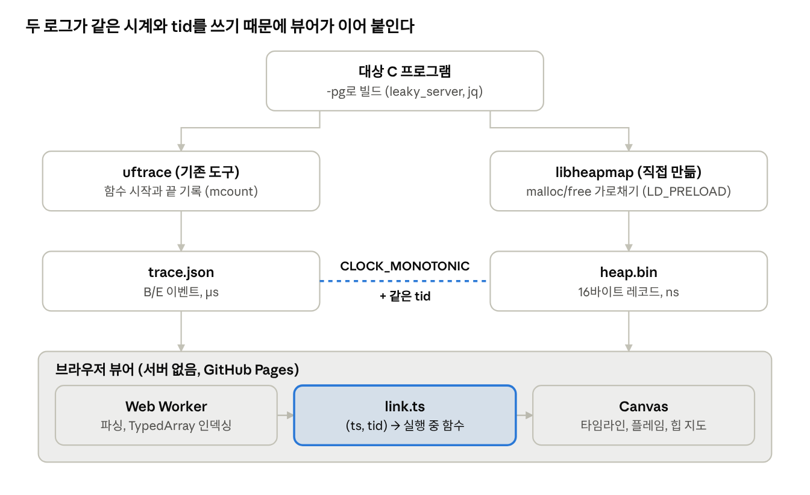

# perf-lens 공부 가이드

2026-09-29 작성

이 가이드는 perf-lens를 처음부터 이해하도록 순서대로 설명합니다. 1장부터 차례로 읽고, 각 장 끝의 확인 질문에 스스로 답해 본 뒤 다음 장으로 넘어가세요.

## 1장. 한눈에 보기

perf-lens는 C 프로그램 하나를 실행해서 **"어떤 함수가 느린가"와 "어떤 함수가 메모리를 얼마나 쓰고 새게 했는가"를 한 화면에서** 보여 주는 도구입니다.

### 왜 만들었나

기존 도구는 둘로 나뉩니다. uftrace나 perf는 시간을 보여 주고, Valgrind나 heaptrack은 메모리를 보여 줍니다. 그래서 "parse\_request가 느린데, 그동안 메모리도 새고 있나?"를 보려면 두 도구를 따로 돌리고 머릿속에서 합쳐야 합니다.

perf-lens는 두 기록에 \*\*같은 시계(CLOCK\_MONOTONIC)와 같은 스레드 번호(tid)\*\*를 찍습니다. 그러면 "할당이 일어난 순간 그 스레드에서 실행 중이던 함수"를 거꾸로 찾을 수 있습니다. 이것이 이 프로젝트의 핵심 아이디어입니다.

### 세 부품

| 부품 | 언어 | 하는 일 | 만든 것 |
| --- | --- | --- | --- |
| uftrace | (기존 도구) | 함수가 언제 시작하고 끝났는지 기록 → `trace.json` | 가져다 씀 |
| libheapmap | C, 약 290줄 | malloc/free를 가로채 기록 → `heap.bin` | 직접 만듦 |
| 뷰어 | TypeScript + Canvas | 두 파일을 읽어 타임라인, 플레임 그래프, 힙 지도를 그림 | 직접 만듦 |

수집은 Jetson Orin Nano(리눅스, arm64)에서 하고, 뷰어는 브라우저에서 돌아갑니다. 서버가 없어서 GitHub Pages에 올린 정적 파일만으로 동작합니다.



위에서 아래로 읽습니다. 두 파일은 따로 만들어지지만 같은 시계와 tid를 쓰고, 뷰어의 link.ts가 그 둘을 이어 붙입니다.

### 데모 시나리오 (이게 되면 프로젝트가 동작하는 것)

1. 일부러 문제를 심은 `samples/leaky_server.c`를 `-pg`로 빌드합니다.
2. `scripts/perf-lens record ./leaky_server` 한 줄로 `trace.json`과 `heap.bin`을 얻습니다.
3. 브라우저에 두 파일을 드롭합니다. 느린 함수 Top 10에 `checksum`, `lookup_route`가 나옵니다.
4. 힙 지도에서 빨간 블록(끝까지 해제 안 됨)이 보이고, 함수별 할당 표에 `parse_request` 아래에서 4,000개가 샌 것이 보입니다.
5. 고친 버전(`-DFIXED`)을 다시 기록해 전후 비교 탭에 넣으면 실행 시간이 288.7ms → 9.5ms로 줄어든 것이 보입니다.

### 샘플에 심은 문제 (정답지)

| 함수 | 문제 | 원인 |
| --- | --- | --- |
| `checksum` | 느림 | 바이트마다 앞부분을 다시 훑는 O(n²) |
| `lookup_route` | 느림 | 2만 개 테이블을 선형 탐색하며 매번 `strcmp` |
| `parse_request` | 누수 | `header` 사본을 malloc하고 아무도 free하지 않음 |
| `cache_put` | 단편화 | 큰 블록과 작은 블록을 번갈아 할당하고 작은 것만 해제 |

**확인 질문**

- 두 로그를 연결하려면 두 로그에 공통으로 무엇이 있어야 하나요?
- 왜 뷰어에 서버가 필요 없나요?

**직접 해 보기**: [데모 페이지](https://wnsrud2002.github.io/perf-lens/)를 열고 힙 지도 탭을 눌러 빨간 칸을 찾아보세요.

## 2장. 배경 지식

이 프로젝트를 이해하는 데 필요한 운영체제 개념은 다섯 가지입니다. 이미 알고 있다면 확인 질문만 풀고 넘어가세요.

### 2.1 프로세스와 스레드

- **프로세스**: 실행 중인 프로그램 하나. 자기만의 메모리 공간을 가집니다. 번호는 pid입니다.
- **스레드**: 프로세스 안에서 동시에 도는 실행 흐름. 같은 프로세스의 스레드는 메모리(힙)를 공유하고, 스택은 따로 가집니다. 번호는 tid입니다.
- `leaky_server`는 메인 스레드 1개 + worker 스레드 2개라서 뷰어에 레인(가로줄)이 3개 보입니다.
- 함수 호출은 스레드별로 따로 쌓이므로, "지금 실행 중인 함수"는 항상 **어느 스레드의** 것인지가 있어야 뜻이 있습니다. 그래서 두 로그 모두 tid를 적습니다.

### 2.2 스택과 힙

|  | 스택 | 힙 |
| --- | --- | --- |
| 무엇이 들어가나 | 지역 변수, 함수 호출 정보 | `malloc`으로 받은 메모리 |
| 언제 사라지나 | 함수가 끝나면 자동 | `free`를 불러야 함 |
| 실수하면 | 스택 오버플로 | **누수**(free를 잊음), 단편화 |

perf-lens가 보는 메모리는 힙입니다. 함수 호출의 중첩(누가 누구를 불렀나)은 스택처럼 쌓이므로, 타임라인의 한 줄 아래로 내려갈수록 더 깊이 불린 함수입니다(깊이 depth).

### 2.3 malloc과 free

- `malloc(n)`: n바이트를 달라고 하면 주소를 돌려줍니다. `calloc`은 0으로 채워서, `realloc`은 크기를 바꿔서 줍니다.
- `free(p)`: 돌려줍니다.
- 이 함수들은 glibc(표준 C 라이브러리) 안에 있습니다. 프로그램은 실행될 때 이 함수를 **이름으로 찾아서** 부릅니다(동적 링크). 그래서 같은 이름의 함수를 먼저 끼워 넣으면 가로처 수 있고, 이것이 4장의 기반입니다.
- glibc는 사용자가 요청한 크기보다 조금 큰 덩어리(청크)를 줍니다. 64비트에서는 (크기 + 8)을 16바이트 단위로 올리고, 최소 32바이트입니다. 힙 지도는 이 규칙으로 블록 사이 빈 틈을 계산합니다.

**누수**: free하지 않은 블록. perf-lens는 "프로그램 종료 때까지 살아 있는 블록"을 **누수 후보**라고 부릅니다. 후보인 이유는 `setlocale` 캐시처럼 일부러 끝까지 들고 있는 메모리도 있기 때문입니다(6장).

**단편화**: 빈 공간의 총량은 충분한데 조각조각 흩어져 있어서 큰 블록을 넣을 자리가 없는 상태. perf-lens의 단편화 지수는 아래와 같습니다. 0이면 빈 공간이 한 덩어리, 1에 가까울수록 잘게 쪼개진 것입니다.

```latex
\text{단편화} = 1 - \frac{\text{가장 큰 빈 틈}}{\text{빈 틈의 합}}
```

### 2.4 시계: CLOCK\_MONOTONIC

- 리눅스에는 시계가 여러 개 있습니다. `CLOCK_REALTIME`은 벽시계라 사람이나 NTP가 시간을 바꾸면 뒤로 갈 수도 있습니다.
- `CLOCK_MONOTONIC`은 부팅 후 흐른 시간이라 절대 뒤로 가지 않습니다. uftrace도 이 시계를 씁니다.
- libheapmap이 같은 시계를 쓰니, 두 로그의 숫자를 그대로 비교할 수 있습니다. 이 지점이 프로젝트 전체의 이음새입니다.
- 단위: heap.bin은 나노초(ns), trace.json은 마이크로초(µs). 뷰어가 heap 시각을 1000으로 나눠 맞춥니다.

### 2.5 프로파일링의 두 방식

| 방식 | 어떻게 | 장점 | 단점 | 예 |
| --- | --- | --- | --- | --- |
| 샘플링 | 일정 간격마다 "지금 어디야?"를 물음 | 가벼움 | 짧은 함수를 놓침, 순서를 모름 | perf |
| 트레이싱(계측) | 모든 함수의 시작과 끝을 기록 | 정확한 순서와 시각 | 오버헤드가 큼 | uftrace |

perf-lens는 "할당 순간에 실행 중이던 함수"를 정확히 알아야 해서 트레이싱을 골랐습니다. 그 대가로 오버헤드와 큰 파일(jq에서 104MB)을 감당해야 하고, 그게 5장과 7장의 주제가 됩니다.

**확인 질문**

- 왜 `CLOCK_REALTIME`이 아니라 `CLOCK_MONOTONIC`을 쓸까요?
- 빈 틈이 100, 100 (합 200)이면 단편화 지수는? 190, 10이면? (답: 0.5, 0.05)
- 종료 때까지 살아 있는 블록이 전부 버그일까요?

## 3장. 함수 트레이스: uftrace

함수가 언제 시작하고 끝났는지는 직접 만들지 않고 uftrace에 맡겼습니다. 검증된 도구가 있으니 바퀴를 다시 만들지 않고 시각화와 연결에 집중하기 위해서입니다.

### 3.1 -pg는 무엇을 하나

`gcc -pg`로 빌드하면 컴파일러가 **모든 함수의 첫머리에 `mcount`(arm64에서는 `_mcount`) 호출을 한 줄 끼워 넣습니다.** 원래는 gprof용 기능입니다.

```c
static unsigned checksum(const char *buf, size_t len)
{
    _mcount();   // -pg가 보이지 않게 넣은 줄
    ...
}
```

uftrace는 이 `mcount`를 자기 함수(libmcount.so 안)로 바꿔 끼워서 "함수 진입"을 알아냅니다. 함수의 **끝**은 스택에 있는 복귀 주소를 자기 함수 주소로 바꿔치기해서 알아냅니다. 함수가 return하면 원래 호출자가 아니라 uftrace로 먼저 돌아오는 것이죠.

샘플에서 함수에 `__attribute__((noinline))`을 붙인 이유도 여기 있습니다. 인라인되면 함수가 호출자 안에 녹아서 사라지고, 트레이스에도 안 나옵니다.

### 3.2 기록과 변환

```bash
uftrace record --no-libcall ./leaky_server   # uftrace.data/ 폴더에 바이너리로 기록
uftrace dump --chrome > trace.json            # Chrome 트레이스 형식 JSON으로 변환
```

- `--no-libcall`: `strcmp`, `memcpy` 같은 libc 호출을 빼서 기록을 사용자 함수 단위로 유지합니다. `lookup_route` 하나가 `strcmp`를 만 번씩 부르므로, 이걸 안 빼면 이벤트가 수천만 건이 됩니다.
- 대신 이러면 libc 안에서 일어난 할당이 그 libc 함수를 부른 사용자 함수에 붙습니다(6장의 jq `main` 사례).
- `scripts/perf-lens record`는 이 두 줄에 libheapmap을 더해 한 줄로 묶은 것입니다.

### 3.3 trace.json 형식

Chrome의 `chrome://tracing`이 읽는 형식입니다. 함수 호출 하나가 이벤트 두 개(B = 시작, E = 끝)가 됩니다.

```json
{"traceEvents":[
{"ts":2174802296179.67,"ph":"B","pid":241736,"name":"handle_request"},
{"ts":2174802296180.10,"ph":"B","pid":241736,"name":"parse_request"},
{"ts":2174802296181.02,"ph":"E","pid":241736,"name":"parse_request"},
...
```

- `ts`: CLOCK\_MONOTONIC, 마이크로초. 부팅 후 흐른 시간이라 2,174,802,296,179µs(약 25일)처럼 큰 수입니다.
- `pid`: uftrace는 여기에 스레드별 번호를 넣습니다. 뷰어는 `tid`가 없으면 `pid`를 tid로 씁니다.
- B와 E는 스레드별로 괄호처럼 짝이 맞습니다. B를 만나면 스택에 넣고, E를 만나면 꺼내서 "시작\~끝" 구간 하나가 됩니다. 스택 깊이가 곧 타임라인의 줄 번호(depth)입니다.
- 예외: `linux:schedule`처럼 짝이 어긋난 E가 있어서, 뷰어는 같은 이름의 B가 스택에 있을 때만 닫습니다(`viewer/src/parse.ts`).

이 형식의 약점은 크기입니다. 이벤트 하나가 70바이트 안팎의 텍스트라, jq 호출 72만 건이 104MB가 됩니다. 이걸 브라우저에서 빠르게 다루는 것이 5장입니다.

**확인 질문**

- `-pg` 없이 빌드한 프로그램을 uftrace로 기록하면 무엇이 나올까요?
- 함수의 끝은 어떻게 알아낼까요?
- B, B, E, B, E, E 순서의 이벤트를 구간과 깊이로 바꿔 보세요.

## 4장. libheapmap: malloc 가로채기

libheapmap은 대상 프로그램을 다시 컴파일하지 않고, `malloc`/`free`/`calloc`/`realloc` 호출을 전부 가로채 `heap.bin`에 적는 공유 라이브러리입니다. 코드는 `heapmap/heapmap.c` 한 파일(약 290줄)입니다.

### 4.1 LD\_PRELOAD와 dlsym(RTLD\_NEXT)

```bash
LD_PRELOAD=./libheapmap.so HEAPMAP_OUT=heap.bin ./leaky_server
```

1. `LD_PRELOAD`에 적은 라이브러리는 glibc보다 **먼저** 실립니다.
2. 프로그램이 `malloc`을 찾으면 먼저 실린 libheapmap의 `malloc`이 걸립니다.
3. libheapmap의 `malloc`은 진짜 malloc을 불러야 합니다. `dlsym(RTLD_NEXT, "malloc")`은 "나 다음으로 실린 라이브러리의 malloc", 즉 glibc의 것을 돌려줍니다.
4. 그래서 후킹 함수는 단순합니다: 진짜 malloc 호출 → 시각 읽기 → 기록 → 반환.

```c
void *malloc(size_t size)
{
    ...
    in_hook = 1;
    void *p = real_malloc(size);
    record(now(), HM_MALLOC, p, size);
    in_hook = 0;
    return p;
}
```

### 4.2 함정 모음: "이 파일 안에서는 malloc을 절대 부르면 안 된다"

후킹 안에서 malloc이 다시 불리면 자기 자신으로 돌아와 무한 재귀에 빠집니다. 코드 곳곳의 이상한 선택은 거의 다 이 문제를 피하려는 것입니다.

| 문제 | 왜 생기나 | 해결 |
| --- | --- | --- |
| dlsym 재귀 | `dlsym`이 내부에서 `calloc`을 부르는데, 아직 진짜 calloc 주소를 모름 | 초기화 중에는 64KB 정적 배열 `boot`에서 잘라 줌. 나중에 이 블록이 free되면 무시하고, realloc되면 진짜 힙으로 옮김 |
| printf 재귀 | `printf`는 내부에서 malloc을 부를 수 있음 | 출력은 `write`만 씀 |
| 기록 중 재진입 | 기록 과정에서 libc가 malloc을 부를 수 있음 | 스레드별 `in_hook` 플래그. 켜져 있으면 기록 없이 진짜 함수만 부름 |
| 버퍼 할당 | 기록 버퍼를 malloc으로 만들면 재귀 | `mmap`으로 직접 받음 |
| TLS 접근 | 스레드 로컬 변수 접근이 `__tls_get_addr`을 거치면 그 안에서 malloc 가능 | `tls_model("initial-exec")`로 고정 오프셋 접근 |

### 4.3 스레드별 버퍼

호출마다 파일에 쓰면 느리고, 전역 버퍼 하나에 모으면 스레드끼리 경합합니다(락이 필요). 그래서:

- 스레드마다 레코드 4,096개(64KB)짜리 버퍼를 `__thread` 변수로 둡니다. 락이 필요 없습니다.
- 버퍼가 차면 `write` 한 번으로 통째로 씁니다. 파일을 `O_APPEND`로 열어서, 두 스레드가 동시에 써도 묶음이 중간에 섞이지 않습니다.
- 대신 파일 안의 레코드는 **시각 순이 아닙니다**(스레드 A의 묶음, B의 묶음이 번갈아 옴). 뷰어가 읽을 때 시각 순으로 다시 정렬합니다.

### 4.4 기록이 사라지지 않게

버퍼에 모아 두는 이상, 프로그램이 끝날 때 비우지 않으면 기록이 날아갑니다. 끝나는 길마다 플러시를 달았습니다.

| 끝나는 길 | 처리 |
| --- | --- |
| 스레드 종료 | `pthread_key_create`의 소멸자가 그 스레드 버퍼를 비움 |
| 정상 종료(`exit`) | `__attribute__((destructor))`가 비움. 그 뒤 오는 free는 버퍼 없이 바로 씀 |
| `_exit`, `_Exit` | 같은 이름으로 가로채 비운 뒤 진짜 함수를 부름 |
| `execve` | 프로세스가 다른 프로그램으로 바뀌기 전에 비움 |
| `fork`한 자식 | 부모 버퍼를 복사해 오므로 자식은 기록하지 않음(`pthread_atfork`) |
| `write`가 시그널에 끊김(EINTR) | 다시 씀. 안 그러면 레코드 4,096개를 잃음 |

알려진 한계(코드에 `ponytail:` 주석으로 표시): 프로세스가 끝날 때 아직 돌고 있는 **다른** 스레드의 버퍼는 잃습니다. 필요하면 전역 버퍼 목록을 두고 전부 비우면 됩니다.

### 4.5 시각을 언제 재나: free는 먼저, malloc은 나중에

작은 순서 차이가 기록을 뒤집을 수 있습니다.

1. 스레드 A가 `free(p)`를 하고 그 **뒤에** 시각을 잰다고 합시다.
2. 그 사이에 스레드 B가 malloc으로 같은 주소 p를 받고 시각을 재면, B의 할당이 A의 해제보다 앞 시각이 됩니다.
3. 뷰어는 "p 할당 → p 해제" 순서를 거꾸로 재생해 블록 수명이 꼬입니다.

그래서 free는 해제 **전에**, malloc은 받은 **뒤에** 시각을 기록합니다.

### 4.6 heap.bin 형식 (version 2)

파일 = 헤더 24바이트 + (묶음 머리 16바이트 + 레코드 16바이트 × count)의 반복. 묶음 하나는 스레드 버퍼 하나를 비운 것입니다.

| 구조 | 필드 | 크기 |
| --- | --- | --- |
| 헤더 | magic `"HEAPMAP\0"`, version, rec\_size, pid | 24B, 한 번 |
| 묶음 머리 | tid, count, base\_ts(ns) | 16B |
| 레코드 | dt(u32, base\_ts부터 ns), size(u32), addr\_type(u64) | 16B |

처음(v1)에는 레코드가 40바이트(ts, addr, size, old 각 8바이트 + tid 4바이트 + type 1바이트 + 빈칸 3바이트)였습니다. 16바이트로 줄인 방법:

- **tid**: 묶음 안 레코드는 모두 같은 스레드라 머리에 한 번만 둡니다.
- **시각**: 묶음 기준 시각과의 차이를 32비트(최대 4.29초)로 둡니다. 넘으면 새 묶음을 시작합니다.
- **type**: 사용자 공간 주소는 48비트 이하라 위 8비트가 비어 있습니다. 거기에 type을 넣습니다.
- **realloc의 원래 주소**: 드물어서 별도 레코드(`HM_REALLOC_OLD`)로 뺨습니다.

결과: jq 기준 heap.bin 6.8MB → 2.7MB, 오버헤드 31.0% → 23.7%. 왜 크기를 줄이는 게 속도에 효과가 있었는지는 7장에서 다룹니다.

### 4.7 uftrace와 함께 쓸 때

`LD_PRELOAD=... uftrace record ./prog`로 돌리면 uftrace 자신도 libheapmap을 싣습니다. 그래서 `init()`에서 프로그램 이름이 `uftrace`면 기록하지 않습니다. 또 자식이 같은 파일을 덮어쓰지 않도록, 대상 프로그램은 환경 변수 `HEAPMAP_OUT`의 첫 글자를 `_`로 바꿔 자기 자식에게는 안 보이게 합니다(malloc 없이 제자리 수정).

**확인 질문**

- `dlsym`이 calloc을 부르는데 왜 이게 문제인가요? `boot` 배열은 어떻게 해결하나요?
- 스레드별 버퍼를 쓰면 얻는 것과 잃는 것은?
- free의 시각을 해제 뒤에 재면 어떤 버그가 생길까요?
- 주소의 위 8비트에 type을 넣어도 되는 근거는?

**코드 읽기**: `heapmap/heapmap.c`를 `malloc` → `record` → `flush` → `init` 순서로 읽으세요.

## 5장. 뷰어: 72만 구간을 60fps로 그리기

뷰어는 TypeScript + Vite + Canvas 2D이고 차트 라이브러리를 쓰지 않습니다. 사각형 수십만 개를 DOM이나 SVG 요소로 만들면 브라우저가 감당하지 못하기 때문입니다. 최적화 다섯 가지로 jq 트레이스(호출 72만 건, 104MB)의 줌이 3fps에서 60fps가 됐습니다.

### 5.1 파일 구성

| 파일 | 역할 |
| --- | --- |
| `worker.ts` | Web Worker. 파일 읽기, JSON.parse, 변환, 분석을 메인 스레드 밖에서 |
| `parse.ts` | B/E 이벤트 → 스레드별 구간(TypedArray), `lowerBound` 이진 탐색 |
| `analyze.ts` | 함수별 self/total 시간, 플레임 그래프 트리 |
| `heap.ts` | heap.bin → 블록 수명 목록, 단편화 계산 |
| `link.ts` | 두 로그 연결 (6장) |
| `main.ts` | 타임라인 그리기, 줌/팬, 검색, 탭 |
| `flame.ts`, `heapview.ts`, `compare.ts` | 플레임 그래프, 힙 지도, 전후 비교 |
| `*.test.ts` | `node --test`로 도는 테스트 10개 |

### 5.2 최적화 다섯 가지

**① 파싱을 Web Worker로.** `JSON.parse`는 104MB를 통째로 처리하는 동안 스레드를 멈춥니다. 메인 스레드에서 하면 화면이 1.5초 얼었고, Worker로 옮기자 최장 멈춤이 83ms가 됐습니다.

**② 객체 배열 대신 TypedArray 열 구조.** 구간 72만 개를 `{start, end, depth, name}` 객체 72만 개로 두는 대신, 속성마다 배열 하나를 둡니다.

```ts
start: Float64Array; // 구간 i의 시작 = start[i]
end:   Float64Array;
depth: Uint16Array;
name:  Uint32Array;  // names 배열의 번호
```

- GC가 훑을 객체가 72만 개에서 몇 개로 줄어 메모리가 50MB → 23MB가 됐습니다.
- Worker에서 메인 스레드로 보낼 때 복사 없이 소유권만 넘깁니다(`postMessage`의 transfer).

**③ 깊이별 이진 탐색.** 같은 스레드, 같은 깊이의 구간은 절대 겹치지 않습니다(함수가 끝나야 같은 깊이의 다음 함수가 시작). 그래서 깊이별로 모으면 start와 end가 모두 오름차순이고, 화면 왼쪽 끝에 걸친 첫 구간을 이진 탐색(`lowerBound`)으로 O(log n)에 찾습니다. 화면 밖 구간은 보지도 않습니다.

**④ LOD(Level of Detail).** 전체 보기에서는 폭이 1픽셀도 안 되는 구간이 수만 개입니다. 같은 픽셀 칸에서 시작하는 것들을 한 칸으로 합쳐 한 번만 그리고, 다음 픽셀의 첫 구간으로 이진 탐색해 건너뜁니다. 그러면 한 줄 그리는 비용이 **구간 수가 아니라 화면 폭(px)에 비례**합니다. 72만 구간이 칸 1만 3천 개로 줄었습니다.

**⑤ 1px 칸은 픽셀 버퍼에 직접 쓰기.** ④까지 하고도 팬이 30fps였습니다. 이 과정이 좋은 공부 재료입니다.

1. 추측: "칸마다 `fillStyle`에 색 문자열을 넣어서 파싱 비용이 든다" → 색별 `Path2D`로 묶었지만 **변화 없음**.
2. 계측: 루프 16ms 중 대부분이 캔버스 API 호출 1만 3천 번 자체의 비용.
3. `ImageData`(픽셀 배열)에 직접 쓰기로 바꿈 → 여전히 30fps.
4. 다시 계측: `Uint32Array.fill()`을 20만 번(칸 × 행) 부르는 호출 비용이 20ms. 한 번에 1\~2픽셀만 채우니 호출 오버헤드가 더 컸습니다.
5. 평범한 `for` 루프 대입으로 바꾸자 60fps(p95 16.8ms).

교훈: 추측으로 고치지 말고, 재고 고치고 다시 잰다.

### 5.3 그 밖의 뷰어 기능

- **self vs total**: total은 자식 함수 시간까지 포함, self는 자기 몸체만. `handle_request`는 total 569ms지만 self는 3ms라 직접 느린 게 아니라 느린 자식(`checksum` self 347ms)을 부르는 것입니다. 재귀 함수는 바깥쪽 호출만 total에 센니다(안 그러면 중복해서 더해집니다).
- **플레임 그래프**: 같은 호출 경로(예: worker → handle\_request → checksum)끼리 시간을 합친 트리. 폭이 넓을수록 시간을 많이 씁니다. 타임라인과 달리 시간 순서는 없습니다.
- **힙 지도**: 블록이 있는 주소 구간만 이어 붙여 격자에 펼칩니다. 칸 하나가 일정 바이트이고, 슬라이더의 시각에 살아 있는 블록을 칠합니다. 슬라이더 끝(종료 후)에서 남은 블록이 전부 빨간 누수 후보입니다.
- **힙 재생**: heap.bin은 시각 순이 아니라서(4.3절) 모든 레코드를 시각 순으로 정렬한 뒤, "주소 → 살아 있는 블록" 맵으로 할당과 해제를 짝지어 블록마다 \[t0, t1) 수명을 만듭니다.

**확인 질문**

- 같은 깊이의 구간이 겹치지 않는다는 사실이 왜 이진 탐색을 가능하게 하나요?
- LOD를 쓰면 그리는 비용이 무엇에 비례하게 되나요?
- TypedArray가 객체 배열보다 빠른 이유 두 가지는?
- self가 크고 total이 비슷한 함수, self가 작고 total이 큰 함수는 각각 무엇을 뜻하나요?

**코드 읽기**: `parse.ts` → `worker.ts` → `main.ts`의 `draw()` 함수.

## 6장. 두 로그 연결: 이 프로젝트의 차별점

할당 블록마다 **할당 순간 그 스레드에서 실행 중이던 함수들**을 찾습니다. 코드는 `viewer/src/link.ts` 하나(110줄)입니다.

### 6.1 알고리즘

블록 b의 할당 시각이 t, 스레드가 tid일 때:

1. tid로 트레이스의 같은 스레드를 찾습니다. 없으면 "트레이스 밖"(main 이전, 기록 안 된 스레드 등).
2. 깊이 0부터 내려가며, 그 깊이에서 t를 품은 구간을 이진 탐색으로 찾습니다(5장 ③과 같은 `lowerBound`).
3. 어떤 깊이에서 못 찾으면 멈춥니다. 부모가 실행 중이 아니면 자식도 아니니까요.
4. 찾은 함수들을 위에서부터 이으면 호출 경로가 됩니다: `main → worker → handle_request → parse_request → dup_token`.

비용은 블록당 O(깊이 × log n)입니다. jq처럼 구간 72만, 할당 9천 건이어도 순식간에 끝납니다.

### 6.2 경로를 번호 하나로

블록마다 경로를 문자열이나 배열로 저장하면 메모리도 많이 들고 비교도 느립니다. 대신 경로를 **(부모 경로 번호, 마지막 함수 이름)** 쌍으로 인터닝해 번호 하나로 줍니다. 트라이(trie)와 같은 구조입니다.

- 경로 수는 블록 수보다 훨씬 적습니다(같은 경로에서 수천 번 할당).
- "이 블록이 `parse_request` 아래에서 할당됐나?"를 블록마다가 아니라 경로마다 한 번만 계산합니다. 부모 경로가 항상 먼저 만들어지므로 배열을 한 번 훑으면 됩니다(`pathMatches`).
- 함수별 할당 표는 경로 위의 모든 함수에 더합니다. 그래서 `worker`와 `handle_request`의 할당 수가 같이 크게 나옵니다. 재귀는 한 번만 센니다.

### 6.3 한계: 시각만 보고 연결하면 틀릴 수 있다 (jq 실전 사례)

jq 1.7.1에 적용했더니 누수 후보 45개가 나왔습니다. 하나씩 파보니 세 종류였습니다.

| 보인 것 | 실제 | 어떻게 확인했나 |
| --- | --- | --- |
| `main`이 할당한 27개 (3.9KB) | glibc `setlocale`의 로켈 캐시. 일부러 안 푼다 | `--no-libcall` 때문에 libc 안의 할당이 `main`에 붙음. libc 호출까지 넣어(`-D 2`) 다시 기록 |
| 트레이스 밖 17개 (174KB) | uftrace의 libmcount가 대상 프로세스 안에서 한 할당 | uftrace 없이 libheapmap만 걸어 비교하면 사라짐 |
| `stack_save`가 할당한 48B 1개 | 역시 libmcount의 할당. 하필 그 순간 `stack_save`가 실행 중이라 거기에 붙음 | jq 소스상 `stack_save`는 최소 수백 바이트를 할당. uftrace 없이 돌리면 사라짐 |

교훈 세 가지:

1. **추적 도구 자신의 할당이 기록에 섞인다.** 관찰하는 행위가 대상을 바꾸는 것이죠.
2. **시각이 겹치면 엉뚱한 함수에 붙는다.** 고치려면 할당한 쪽의 반환 주소를 기록해 libmcount 안이면 빼야 합니다. 다만 libmcount가 `strdup` 같은 libc 함수를 거치면 반환 주소가 libc를 가리켜 이것만으로는 다 걸러지지 않습니다.
3. **다른 조건으로 한 번 더 돌려 교차 확인한다.** 이번에는 "uftrace 없이 한 번 더"가 답이었습니다.

결론적으로 jq 자체의 진짜 누수는 찾지 못했습니다. "누수 없음"을 근거와 함께 확인한 것도 분석 결과입니다. 자세한 내용은 `CASES.md`에 있습니다.

**확인 질문**

- 깊이 d에서 t를 품은 구간이 없으면 왜 더 깊이 볼 필요가 없나요?
- 경로를 번호로 인터닝하면 무엇이 좋아지나요?
- 함수별 표에서 `main`이 직접 할당한 것처럼 보이면 무엇을 의심해야 하나요?
- 48B 블록이 `stack_save`의 것이 아니라는 근거 두 가지는?

## 7장. 성능 측정 방법

이 프로젝트에서 가장 가치 있는 것은 수치 자체보다 **수치를 얻은 방법**입니다. 조건을 고정하고, 비용을 나누고, 가설을 싸게 시험한 뒤 채택했습니다. 자세한 수치는 `BENCH.md`에 있습니다.

### 7.1 조건 고정

- **클럭 고정**: Jetson은 부하에 따라 CPU 클럭을 올렸다 내렸다 합니다(DVFS). 그대로 재면 같은 프로그램도 매번 시간이 다릅니다. `sudo jetson_clocks`로 1.728GHz에 고정합니다.
  - `jetson_clocks`는 "GPU frequency scaling not supported" 오류를 내지만 CPU는 고정됩니다. `scaling_min_freq`와 `scaling_max_freq`가 같은지로 확인합니다. 재부팅하면 풀립니다.
- **반복과 중앙값**: `hyperfine -N --warmup 3`으로 30번 돌리고 중앙값을 씁니다. 평균은 한 번의 튀는 값에 끌려갑니다.
- **비교 대상은 같은 세션에서 번갈아**: v1과 v2를 따로 재면 그 사이 온도나 다른 프로세스 차이가 섞입니다.
- **조건을 수치와 함께 적기**: "Orin Nano, jetson\_clocks, headless Chromium 153"처럼. 조건이 없는 수치는 믿을 수 없습니다.

### 7.2 후킹 오버헤드: 비용부터 나누기

라이브러리를 단계별로 잘라 만든 변형 네 개를 재서, 호출 한 번에 드는 비용을 나눴습니다(할당만 하는 1스레드 테스트).

| 단계 | 추가 비용 |
| --- | --- |
| 후킹 함수만 거침 | 4.5 ns |
| + 시각 읽기 (`clock_gettime`) | 48 ns |
| + 스레드 버퍼에 기록 | 14 ns |
| + 파일 쓰기 | 58 ns |

### 7.3 후보 세 개를 싸게 시험

고치기 전에 후보마다 빠르게 프로토타입을 만들어 재고, 효과가 있는 것만 채택했습니다.

| 후보 | 가설 | 결과 | 판단 |
| --- | --- | --- | --- |
| 버퍼 16배 (write 횟수 1/16) | write 시스템 호출이 비싸다 | 변화 없음 | 횟수가 아니라 바이트 수가 문제. 버림 |
| 레코드 40 → 16바이트 | 쓰는 바이트 수에 비례한다 | 호출당 23\~36ns 감소 | **채택** |
| arm64 카운터(`isb; mrs cntvct_el0`)로 시각 읽기 | `clock_gettime`보다 싸다 | 단독으로는 20ns 이득, 후킹 안에서는 8ns, 4스레드는 악화 | 버림 |

세 번째가 면접에서 쓰기 좋은 이야기입니다.

- **마이크로벤치마크와 실제가 다르다**: `clock_gettime`의 지연은 CPU가 주변 명령과 겹쳐 처리해서 가려집니다. `isb`(명령 동기화 장벽)는 그 겹침을 막습니다.
- **`isb`를 뺄 수 없다**: 빼면 시각 읽기가 앞뒤 명령과 순서가 바뀌어, free 시각을 해제 전에 재는 보장(4.5절)이 깨질 수 있습니다.
- **시계가 어긋난다**: 카운터를 공칭 주파수(31.25MHz)로 환산하면 CLOCK\_MONOTONIC과 1초에 25µs(25ppm) 어긋났습니다. NTP가 CLOCK\_MONOTONIC의 빠르기를 미세 조정하기 때문입니다. `dup_token` 한 번이 0.3µs라 이 오차면 할당이 엉뚱한 함수에 붙습니다.

최종 결과는 jq 기준 오버헤드 31.0% → 23.7%입니다. 남은 비용의 가장 큰 덩어리는 `clock_gettime`(48ns)이지만, 두 로그를 같은 시계로 잇는 것이 핵심이라 남겼습니다.

### 7.4 뷰어 측정의 함정

뷰어는 `viewer/bench.mjs`가 Playwright로 headless Chromium을 띄워 측정합니다. 처음에는 수치가 틀렸던 이유들입니다.

| 함정 | 증상 | 해결 |
| --- | --- | --- |
| 측정 서버의 즐석 gzip | 읽기가 0.44초 → 3.8초로 부풀음 | 측정할 때는 압축 끄기 |
| 빈 프레임 섞임 | 이벤트를 밖에서 하나씩 보내면 다시 그리지 않는 프레임이 섞여 60fps로 잘못 나옴 | 페이지 안에서 매 프레임 이벤트를 넣음 |
| TypedArray 메모리 | JS 힙에 안 잡혀 2MB로 나옴 | ArrayBuffer 저장소 크기를 더함 |
| 100MB 응답 | Playwright `route.fulfill`에서 페이지가 조용히 닫힘 | 서버가 직접 서빙하게 심볼릭 링크 |
| 60fps 상한 | 화면 주사율이 60Hz라 16.7ms 밑으로 안 내려감 | "60fps에 닿았다"까지만 말함 |

**확인 질문**

- 왜 평균이 아니라 중앙값을 쓸까요?
- write 횟수를 줄여도 효과가 없었다는 것은 무엇을 알려 주나요?
- 마이크로벤치마크에서 20ns 빨랐던 방법이 실제로는 8ns뿐이었던 이유는?
- 측정 결과가 너무 좋게 나오면 무엇부터 의심해야 할까요?

## 8장. 직접 해 보기

Orin Nano에서 `~/workspace/perf-lens`를 기준으로 위에서부터 하나씩 따라 치세요. 각 단계의 "볼 것"을 확인한 뒤 다음으로 넘어갑니다.

### 실습 1. 샘플을 그냥 실행하기

```bash
cd ~/workspace/perf-lens/samples
make leaky_server
./leaky_server
```

볼 것: `done: 2 threads, checksum ...` 한 줄. 그다음 `leaky_server.c` 맨 위 주석에서 심어 둔 문제 4개를 읽어 둡니다.

### 실습 2. uftrace만 써 보기

```bash
uftrace record --no-libcall ./leaky_server
uftrace report | head -15     # 함수별 시간 표
uftrace replay | head -30     # 호출 순서를 들여쓰기로
```

볼 것: report에서 `checksum`과 `lookup_route`가 위에 있나요? replay에서 `handle_request` 안에 `parse_request`, `lookup_route`, `checksum`이 순서대로 보이나요?

### 실습 3. libheapmap만 써 보기

```bash
make -C ../heapmap libheapmap.so
LD_PRELOAD=../heapmap/libheapmap.so HEAPMAP_OUT=/tmp/h.bin ./leaky_server
python3 ../heapmap/heapdump.py /tmp/h.bin | head
```

볼 것: malloc/free 횟수와 `alive at exit`(종료 때 살아 있는 블록). 왜 4,000개가 넘게 남을까요? (힌트: worker 2개 × 요청 2,000개)

### 실습 4. 둘을 한 번에: perf-lens record

```bash
cd ~/workspace/perf-lens
scripts/perf-lens record -o /tmp/out samples/leaky_server
ls -la /tmp/out
```

볼 것: `trace.json`과 `heap.bin`. `scripts/perf-lens`를 열어 보면 실습 2와 3을 한 줄로 합친 것뿐임을 확인합니다.

### 실습 5. 뷰어에서 문제 4개 찾기

[데모 페이지](https://wnsrud2002.github.io/perf-lens/)를 열거나, 맥 브라우저에 실습 4의 두 파일을 드롭합니다.

- [ ] 느린 함수 Top 10에서 `checksum`, `lookup_route`를 찾고 self와 total을 비교했다
- [ ] 타임라인을 휠로 확대해 `handle_request` 하나 안의 호출 순서를 봤다
- [ ] 힙 지도 탭에서 빨간 블록을 클릭해 할당한 함수(`dup_token`, 경로에 `parse_request`)로 이동했다
- [ ] 함수별 할당 표에서 `parse_request`의 누수 4,000개를 찾았다
- [ ] 타임라인에서 `cache_put`을 클릭하고 슬라이더를 움직여 단편화 지수가 변하는 것을 봤다

### 실습 6. 고치고 비교하기

```bash
cd ~/workspace/perf-lens/samples
make trace-fixed.json      # -DFIXED로 빌드해 기록
```

뷰어에서 원래 파일을 연 뒤 전후 비교 탭의 "지금 결과를 기준(전)으로"를 누르고, `trace-fixed.json`과 `heap-fixed.bin`을 드롭합니다. 볼 것: 실행 시간 약 −97%, 누수 후보 감소.

### 실습 7. (도전) 코드를 바꿔 보기

1. **재귀를 직접 겪어 보기.** `heapmap.c` 맨 위에 `#include <stdio.h>`를 넣고, `malloc` 후킹의 `record(...)` 바로 뒤에 `printf("hi\n");`를 넣어 빌드한 뒤 실습 3을 돌리세요. 그다음 `if (in_hook) return real_malloc(size);` 두 줄까지 지우고 다시 돌리세요. 마친 뒤 `git checkout heapmap/heapmap.c`로 되돌립니다.
   - 예상 결과(직접 확인함): 플래그가 있으면 `hi`가 약 1만 3천 번 찍히고 정상 종료합니다. 플래그를 지우면 아무것도 찍히지 않고 `Segmentation fault`가 납니다. printf가 출력 버퍼를 malloc하고, 그 malloc이 다시 printf를 부르는 무한 재귀로 스택이 넘친 것입니다.
2. `leaky_server.c`에 새 누수를 하나 심고, 뷰어가 찾아내는지 확인하세요.
3. `cd viewer && npm test`로 테스트 10개를 돌리고, `parse.test.ts` 하나를 읽어 보세요.

## 9장. 면접 예상 질문과 답

답을 외우기보다, 답을 가리고 자기 말로 설명해 본 뒤 비교하세요. 숫자 하나와 "왜"를 함께 말하는 것이 핵심입니다.

### 프로젝트 전체

**Q. 한 문장으로 소개해 주세요.** uftrace의 함수 타임라인과 직접 만든 malloc 후킹 라이브러리의 힙 기록을 같은 시계로 연결해서, 함수를 클릭하면 그 함수가 한 할당과 누수가 보이는 브라우저 분석 도구입니다.

**Q. 기존 도구와 뭐가 다른가요?** perf나 uftrace는 시간을, Valgrind나 heaptrack은 메모리를 봅니다. heaptrack도 할당한 콜스택을 보여 주지만 시간 축의 함수 실행과는 연결되지 않습니다. perf-lens는 "이 함수가 느렸던 바로 그 실행에서 무엇을 할당했나"를 한 화면에서 봅니다. 대신 콜스택을 직접 재지 않고 시각으로 연결하기 때문에 6장의 한계가 있습니다.

### libheapmap

**Q. malloc을 어떻게 가로채나요?** LD\_PRELOAD로 같은 이름의 함수를 glibc보다 먼저 싣고, 안에서 `dlsym(RTLD_NEXT)`로 진짜 malloc을 찾아 부릅니다. 대상 프로그램은 다시 빌드할 필요가 없습니다.

**Q. 가장 어려웠던 점은?** 후킹 안에서 malloc이 다시 불리는 재귀입니다. dlsym 자체가 calloc을 부르므로 초기화 중에는 정적 배열에서 잘라 줬고, printf 대신 write, 버퍼는 mmap, TLS는 initial-exec 모델을 썼습니다. 스레드별 재진입 플래그도 두었는데, 이걸 지우고 printf를 넣으면 실제로 세그폴트가 납니다.

**Q. 멀티스레드는 어떻게 처리했나요?** 스레드마다 64KB 버퍼를 두어 락을 없앴고, 버퍼가 차면 O\_APPEND로 연 파일에 write 한 번으로 씁니다. 그래서 파일은 시각 순이 아니고, 뷰어가 정렬합니다. 검증은 스레드 8개 × 2만 번 테스트에서 기록된 이벤트 수가 실제 호출 수와 같은지로 했습니다(`make check`).

**Q. 오버헤드는 얼마이고, 어떻게 줄였나요?** (핵심 소재) jq 기준 31.0% → 23.7%입니다. 먼저 단계별 변형으로 비용을 나눠 시각 읽기 48ns, 파일 쓰기 58ns를 확인했습니다. write 횟수를 1/16로 줄여도 효과가 없어서 횟수가 아니라 바이트 수가 문제라고 판단했고, 레코드를 40에서 16바이트로 줄였습니다. arm64 카운터는 마이크로벤치마크에서 20ns 이득이었지만 실제로는 8ns였고 멀티스레드에서 악화돼 버렸습니다.

**Q. 버그를 찾은 적이 있나요?** realloc이 실패하면 원래 블록은 살아 있는데, v1은 그걸 해제된 것으로 기록했습니다. 포맷을 바꾸면서 발견해 고치고 테스트를 추가했습니다. 또 free의 시각을 해제 뒤에 재면 다른 스레드가 같은 주소를 먼저 받아 순서가 뒤집히므로, 해제 전에 시각을 기록합니다.

### 뷰어

**Q. 100만 이벤트를 어떻게 60fps로 그렸나요?** (핵심 소재) Worker로 파싱해 멈춤을 1.5초에서 83ms로, TypedArray 열 구조로 메모리를 50에서 23MB로 줄였습니다. 같은 깊이 구간은 겹치지 않아 이진 탐색으로 보이는 것만 찾고, 1px보다 좁은 구간은 픽셀 칸으로 합쳤습니다(LOD). 마지막으로 캔버스 호출 자체가 병목이라 픽셀 버퍼에 직접 썼습니다. 줌은 3fps에서 60fps, 팬은 1fps에서 60fps가 됐습니다.

**Q. 추측이 틀린 적이 있나요?** 색 문자열 파싱이 느리다고 보고 Path2D로 묶었는데 변화가 없었습니다. 재 보니 캔버스 API 호출 1만 3천 번 자체가 비쌌고, 픽셀 버퍼로 바꾼 뒤에는 `fill()` 호출 20만 번이 또 병목이었습니다. 그 뒤로는 고치기 전에 먼저 측정합니다.

### 한계와 확장

**Q. 이 방식의 한계는?** 시각과 tid만으로 연결하므로, 추적 도구 자신의 할당이 그 순간 실행 중이던 사용자 함수에 붙습니다. jq에서 48바이트 블록이 `stack_save`에 잘못 붙은 것을 소스 분석과 "uftrace 없이 다시 실행"으로 밝혔습니다. 또 glibc 청크 규칙을 가정하므로 jemalloc에서는 단편화 수치가 부정확합니다. 종료 시 아직 도는 다른 스레드의 버퍼도 잃습니다.

**Q. 더 한다면?** 할당 호출자의 반환 주소를 기록해 도구의 할당을 걸러내기, uftrace 바이너리를 직접 파싱해 104MB JSON 단계를 없애기, 1,000만 이벤트가 필요하면 스트리밍 파서입니다.

**Q. 왜 uftrace를 직접 만들지 않았나요?** 검증된 도구가 있고, 이 프로젝트의 가치는 연결과 시각화에 있습니다. 대신 힙 기록은 포맷과 오버헤드를 직접 통제해야 해서 만들었습니다.

## 부록. 용어 사전과 코드 읽는 순서

### 용어 사전

| 용어 | 뜻 | 나오는 곳 |
| --- | --- | --- |
| tid | 스레드 번호. 두 로그를 잇는 열쇠 둘 중 하나 | 2.1, 6장 |
| CLOCK\_MONOTONIC | 뒤로 가지 않는 시계. 두 로그를 잇는 나머지 열쇠 | 2.4 |
| 청크(chunk) | glibc가 실제로 내주는 메모리 덩어리. 요청보다 조금 큼 | 2.3 |
| 누수 후보 | 종료 때까지 free되지 않은 블록 | 2.3, 6.3 |
| 단편화 지수 | 1 − (가장 큰 빈 틈 / 빈 틈 합) | 2.3 |
| -pg, mcount | 함수 첫머리에 계측 호출을 넣는 컴파일 옵션과 그 함수 | 3.1 |
| B / E 이벤트 | trace.json의 함수 시작(Begin) / 끝(End) | 3.3 |
| LD\_PRELOAD | 지정한 라이브러리를 가장 먼저 싣게 하는 환경 변수 | 4.1 |
| dlsym(RTLD\_NEXT) | "나 다음에 실린" 같은 이름의 함수를 찾음 | 4.1 |
| 재진입(reentrancy) | 함수가 끝나기 전에 같은 함수가 다시 불리는 것 | 4.2 |
| TLS, `__thread` | 스레드마다 따로 갖는 전역 변수 | 4.2, 4.3 |
| O\_APPEND | 항상 파일 끝에 쓰기. 한 번의 write가 다른 write와 섞이지 않음 | 4.3 |
| Web Worker | 브라우저의 백그라운드 스레드. 화면을 멈추지 않고 무거운 일을 함 | 5.2 |
| TypedArray | 숫자만 담는 고정 형식 배열(Float64Array 등) | 5.2 |
| transfer | Worker 사이에 배열을 복사하지 않고 소유권만 넘김 | 5.2 |
| lowerBound | 정렬된 배열에서 "v 이상인 첫 위치"를 찾는 이진 탐색 | 5.2, 6.1 |
| LOD | 멀리서 볼 때는 요약본을 그리는 기법 | 5.2 |
| self / total | 함수 자체 시간 / 자식까지 포함한 시간 | 5.3 |
| 플레임 그래프 | 같은 호출 경로끼리 시간을 합친 트리 그림 | 5.3 |
| 인터닝 | 같은 값을 번호 하나로 바꿔 한 번만 저장 | 6.2 |
| DVFS | 부하에 따라 CPU 클럭을 자동으로 바꾸는 기능 | 7.1 |
| p95 | 값 100개를 줄 세웠을 때 95번째. "가끔 느린 프레임" 지표 | 7.4 |

### 코드 읽는 순서

전체 코드는 약 2,000줄입니다. 이 순서로 읽으면 각 파일이 앞 파일의 결과를 쓰는 흐름이 보입니다.

1. `samples/leaky_server.c` (151줄): 분석 대상. 심어 둔 문제 4개
2. `heapmap/heapmap.h` (36줄): heap.bin 구조체. `heapmap/FORMAT.md`와 함께
3. `heapmap/heapmap.c` (287줄): `malloc` → `record` → `flush` → `init` → `free`/`realloc` → 종료 처리
4. `scripts/perf-lens` (22줄): 수집 한 줄
5. `viewer/src/parse.ts` (95줄): B/E → 구간, `lowerBound`
6. `viewer/src/analyze.ts` (57줄): self/total, 플레임 그래프
7. `viewer/src/heap.ts` (137줄): heap.bin 재생, 단편화
8. `viewer/src/link.ts` (110줄): 두 로그 연결 (차별점)
9. `viewer/src/worker.ts` (49줄): 위 것들을 Worker에서 부르는 순서
10. `viewer/src/main.ts` (485줄): `draw()`, 줌/팬, 클릭 처리
11. `*.test.ts`: 각 모듈이 무엇을 보장하는지

각 파일을 읽은 뒤 "이 파일은 무엇을 받아 무엇을 내놓나"를 한 줄로 적어 보세요. 11줄이 모이면 전체 구조를 설명할 수 있습니다.

함께 볼 문서: `README.md`, `BENCH.md`(측정 전체), `CASES.md`(jq 분석), `PLAN.md`(처음 세운 8주 계획). 저장소: [github.com/wnsrud2002/perf-lens](https://github.com/wnsrud2002/perf-lens)
